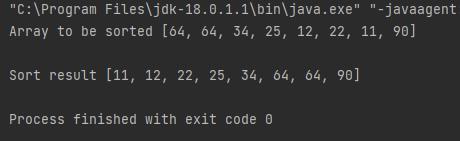

# Bubble sort

## About
Java project built to demonstrate the usage of a bubble sort algorithm in order to sort an array containing integers

The algorithm implements the below interface and fulfils its contract
```JAVA

public interface Sorter {
    int[] sortArray(int[] arrayToSort);
}

```

The algorithm loops through the array and compares elements with consecutive indexes and if the first compared element
is lowe than the second swaps their places in the array. After each loop the iteration starts from the <code >array.length - i - 1</code>
to prevent redundant rechecks of already checked elements in the array. The <code>swap</code> boolean checks if any swaps
have taken place through a complete iteration of the array to prevent redundant rechecks of the elements as if we iterate
through the whole array and no swaps were required it means the array is already sorted and we can safely break the loop.
```JAVA
public  class BubbleSortOne implements Sorter {

    @Override
    public int[] sortArray(int[] arrayToSort) {
        if(arrayToSort.length <= 1) return arrayToSort;
        int[] arrayCopy = arrayToSort.clone();

        boolean swapped;
        int numToSwap;

        for(int i = 0; i < arrayCopy.length - 1; i++) {
            swapped = false;
            for (int j = 0; j < arrayCopy.length - i - 1; j++) {
                if(arrayCopy[j] > arrayCopy[j + 1]) {
                    numToSwap = arrayCopy[j];
                    arrayCopy[j] = arrayCopy[j+1];
                    arrayCopy[j+1] = numToSwap;
                    swapped = true;
                }
            }
            if (!swapped) break;
        }
        return arrayCopy;
    }
}
```
The sortArray method does not change the original array as it returns a new copy of the array.
## Execution example

## Getting started
The project requires the Java SDK to run. Simply clone the repo and you'll be able to build and run the project.

## Author
Andrei Hirleata