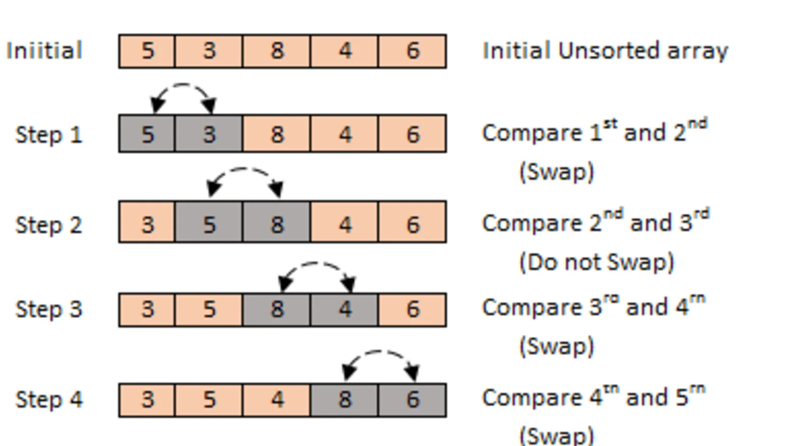
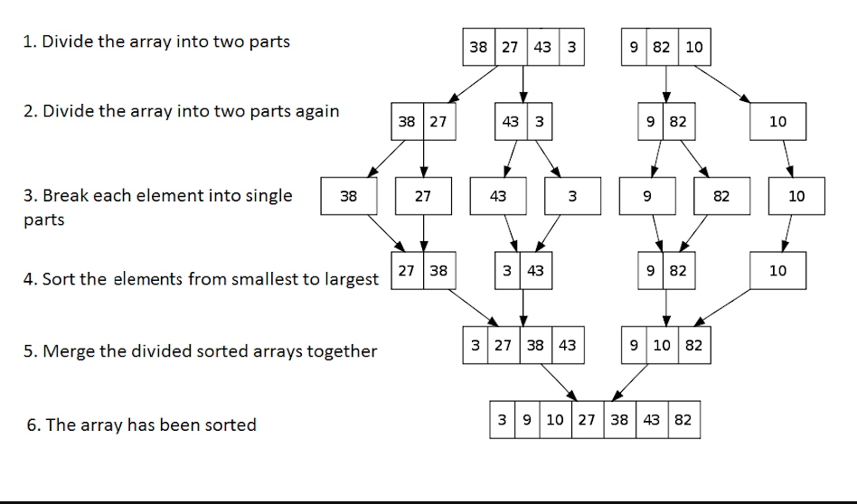
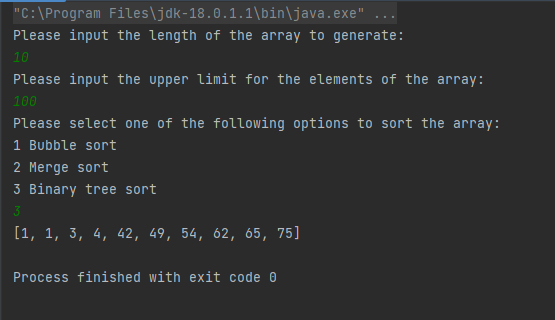

# Sort Manager

## About
Java project that demonstrates the use of Bubble Sort, Binary Tree Sort, Merge Sort algorithms to sort an array.

The algorithm implements the below interface and fulfils its contract
```JAVA

public interface Sorter {
    int[] sortArray(int[] arrayToSort);
}
```

## Sorting algorithms

* Bubble Sort  
The bubble sort algorithm iterates through the array and every time it encounters an element which is lower that the 
next one in the array swaps their place.

We keep track if any swaps have taken place in a loop iteration with the <code>swapped</code> to prevent redundant 
loops through the array as if no swaps have taken place in an iteration it means the array is already sorted.
```JAVA
    public int[] sortArray(int[] arrayToSort) {
        if(arrayToSort.length <= 1) return arrayToSort;

        boolean swapped;
        int numToSwap;

        for(int i = 0; i < arrayToSort.length - 1; i++) {
            swapped = false;
            for (int j = 0; j < arrayToSort.length - i - 1; j++) {
                if(arrayToSort[j] > arrayToSort[j + 1]) {
                    numToSwap = arrayToSort[j];
                    arrayToSort[j] = arrayToSort[j+1];
                    arrayToSort[j+1] = numToSwap;
                    swapped = true;
                }
            }
            if (!swapped) break;
        }


        return arrayToSort;
    }
}
```

* Merge Sort  
The merge sort algorithm breaks down an array in half each iteration until only single element arrays remain
then rejoins them using the <code>merge</code> method recursively until all the final sorted array is obtained.
```JAVA
    public static void merge(int[] arr, int[] leftArray, int[] rightArray, int left, int right) {
        int leftIndex = 0;
        int rightIndex = 0;
        int mergedArrayPosition = 0;

        while (leftIndex < left && rightIndex < right) {
            if (leftArray[leftIndex] < rightArray[rightIndex]) {
                arr[mergedArrayPosition++] = leftArray[leftIndex++];
            } else  {
                arr[mergedArrayPosition++] = rightArray[rightIndex++];
            }
        }

        while (leftIndex < left) {

            arr[mergedArrayPosition++] = leftArray[leftIndex++];
        }

        while (rightIndex < right) {

            arr[mergedArrayPosition++] = rightArray[rightIndex++];
        }

    }
```

* Binary Tree Sort  
The binary tree sort creates a binary search tree from the elements of the input array and performs an in-order traversal
on the created binary search tree to get the elements in sorted order and adds returns a sorted array. The insertion process
uses the <code>insert(Node root, int data)</code> method recursively.
```JAVA
    void insert(Node root, int data) {
        if (root.data >= data) {
            if (root.left == null) {
                root.left = new Node(data);
            } else {
                insert(root.left, data);
            }
        } else {
            if (root.right == null) {
                root.right = new Node(data);
            } else {
                insert(root.right, data);
            }
        }
    }
```
    
In order to merge the binary search tree back into a sorted array we traverse it adding the left most node's data into the
array in order.
```JAVA
    public int inorderArr(Node root,int[] arr,int index) {
        if (root != null) {
            if (root.left != null) {
                index = inorderArr(root.left, arr, index);
            }
            arr[index++] = root.data;
            if (root.right != null) {
                index = inorderArr(root.right, arr, index);
            }
        }
        return index;
    }
```
## Execution example

## Getting started
The project requires the Java SDK to run. Simply clone the repo and you'll be able to build and run the project.

## Author
Andrei Hirleata